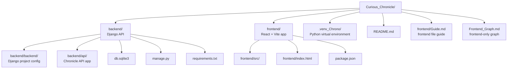
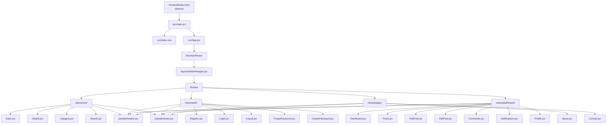
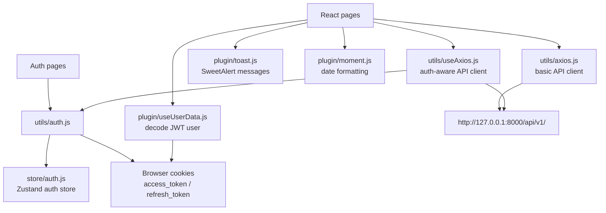
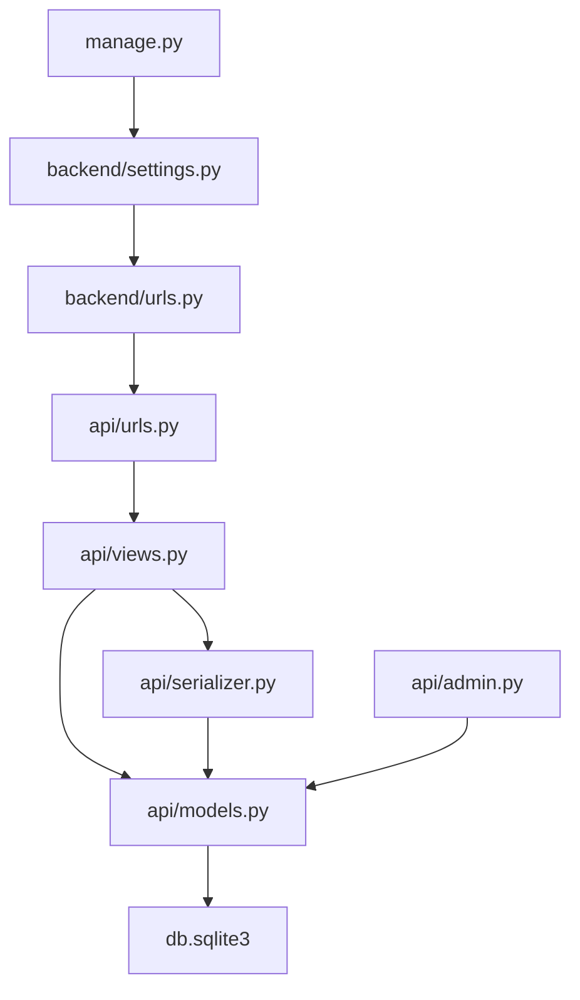
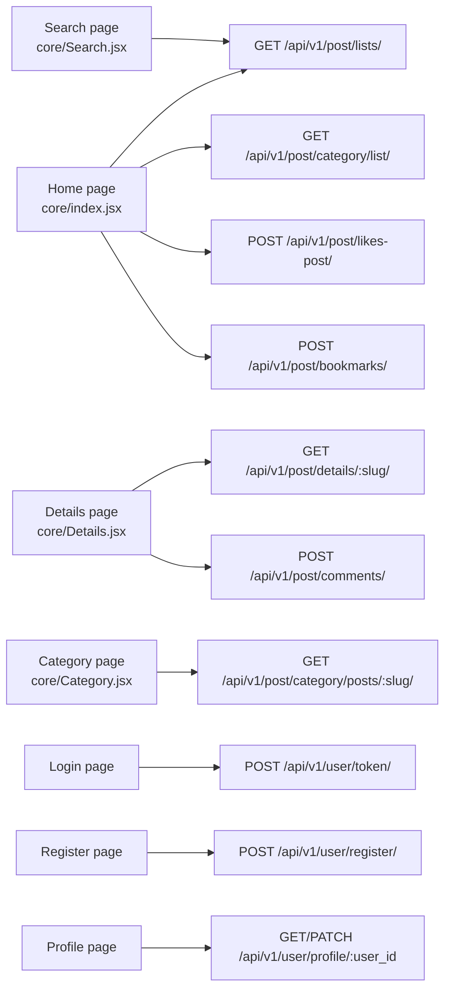
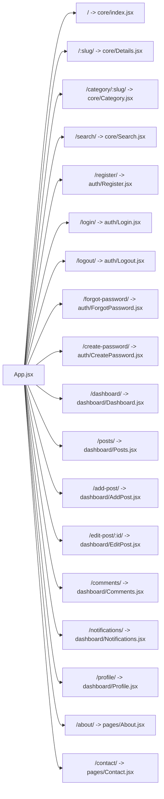

# Curious Chronicle Project Graph

This file is generated from the project root (`.`). It gives a visual map of how the Django backend and React frontend are connected.

## Root Structure

## Frontend Flow

## Frontend Services And State

## Backend Flow

## Frontend To Backend API Map

## Route Map

## Design Editing Hotspots

```mermaid
flowchart TD
    DESIGN["Design changes"] --> NAV["Header/navigation<br/>frontend/src/views/partials/header.jsx"]
    DESIGN --> FOOT["Footer<br/>frontend/src/views/partials/footer.jsx"]
    DESIGN --> HOME_DESIGN["Homepage<br/>frontend/src/views/core/index.jsx"]
    DESIGN --> ARTICLE_DESIGN["Article details<br/>frontend/src/views/core/Details.jsx"]
    DESIGN --> CAT_DESIGN["Category page<br/>frontend/src/views/core/Category.jsx"]
    DESIGN --> SEARCH_DESIGN["Search page<br/>frontend/src/views/core/Search.jsx"]
    DESIGN --> AUTH_DESIGN["Login/Register<br/>frontend/src/views/auth/"]
    DESIGN --> DASH_DESIGN["Dashboard<br/>frontend/src/views/dashboard/"]
    DESIGN --> GLOBAL_STYLE["Global layout styles<br/>frontend/src/index.css"]
```

